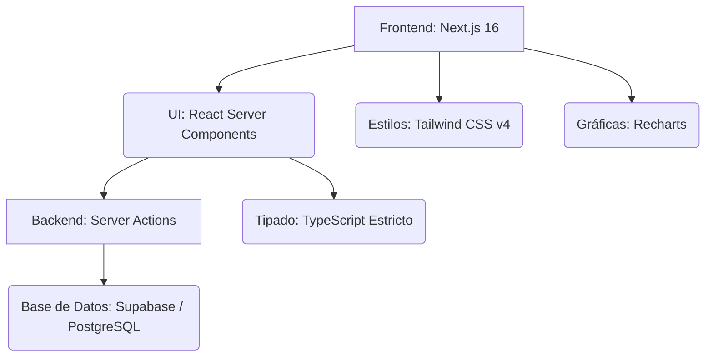
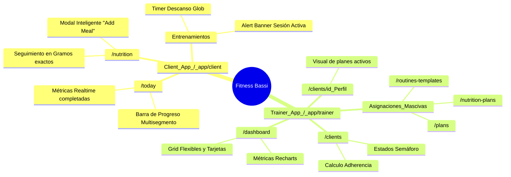
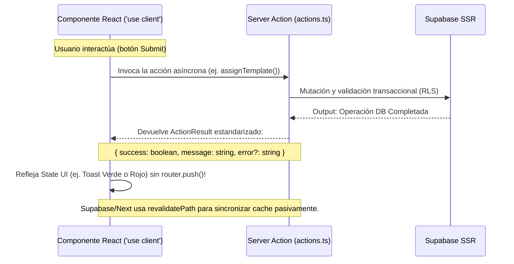

# 🧠 Memoria del Proyecto: Fitness Bassi (`app-fitness-bassi`)

Este documento centraliza el contexto del proyecto, la arquitectura, el stack tecnológico y el historial de cambios recientes. Sirve como guía de referencia para cualquier desarrollador que se incorpore o continúe trabajando en el proyecto.

---

## 🏗️ Stack Tecnológico

El proyecto está construido sobre las siguientes tecnologías principales, garantizando rendimiento, tipado estricto y una UI moderna:

**Librerías Clave**:
- **Next.js 16** (App Router, Turbopack)
- **TypeScript** (Modo estricto, sin `any` explícitos)
- **Tailwind CSS v4** (Sistema de utilidades directas)
- **Supabase SSR** (Base de datos remota, Autenticación y Row Level Security)
- **Recharts** (Visualización interactiva y responsiva de datos)
- **Lucide React** (Iconografía consistente y minimalista)

---

## 🎨 Sistema de Diseño (Slate)

El proyecto utiliza un entorno visual de diseño oscuro, estructurado mediante los siguientes "Design Tokens" (integrados en variables nativas o utilities de Tailwind):

| Elemento | Variable / Clase | Aproximación Hexadecimal | Descripción Referencial |
| :--- | :--- | :--- | :--- |
| **Fondo Base** | `bg-base` | `#191919` | Gris muy oscuro pardo, base de toda la web. |
| **Fondo Superficie** | `bg-surface` | `#212121` | Gris oscuro para contener elementos neutros. |
| **Elevación UI** | `bg-elevated` | `#2a2a2a` | Gris medio. Cards flotantes, dropdowns, y modales. |
| **Acento** | `accent` | `#6b7fa3` | Azul/Grisáceo apagado. Componente elegante no invasivo. |
| **Marca / Alerta** | *S/N Amarilla* | `#f5c518` | Amarillo vibrante "Fitness Bassi" para loading glows. |
| **Texto Titular** | `text-primary` | `#e8e8e6` | Blanco roto suave que minimiza la fatiga visual. |
| **Texto Secundario**| `text-muted` | `#a0a0a0` | Gris intermedio, placeholders y subtítulos. |
| **Estado Critico** | `danger` | `#f87171` | Rojo atenuado para borrados y alertas rojas adherencia. |

> 📱 **Breakpoints Estructurales**: 
> - **Mobile**: `<768px`
> - **Tablet**: `768-1023px`
> - **Desktop**: `1024px+`
> 
> *La aplicación sigue una filosofía "Mobile-first" cuidando meticulosamente la versión Desktop ampliada.*

---

## 🏛️ Arquitectura Estructural

La lógica encapsula a dos distintos "tipos de agentes" que dividen sus responsabilidades bajo sub-rutas `app/(rol)`:

### 1. Panel de Entrenador (`/app/(trainer)`) — Administrador / "Bassi"
- **`/dashboard`**: Resumen. Integración de visualizaciones dinámicas responsivas usando envoltorios `<ResponsiveContainer>` y reajuste condicional del `overflow`.
- **`/clients` & `/clients/[id]`**: Panel exhaustivo. KPIs de adherencia de 30 días, estado de abandono, última sesión y derivación a ficha completa (gestión 360 y visual del Active Plan derivado).
- **`/plans` & `/routines-templates`**: Constructor lógico de rutinas y distribuciones macro de los entrenamientos. Interfaces que relacionan clientes directos en UI sin salirte de subrutas.
- **`/nutrition-plans`**: Entorno CRUD dietético. Diferencia pragmática entre el "Repositorio Local de Plantillas" vs "Bóveda Privada del Trainer". Modal de asignaciones en un click evitando redirecciones vacías mediante triggers locales e interceptación de eventos en background.

### 2. Visión del Cliente (`/app/(client)`) — Usuario Final
- **`/today`**: Hub primario en forma de To-Do list avanzado. Barras renderizadas según particiones fraccionales (divisores 1px calculados) interpretables velozmente.
- **`/nutrition`**: Rastreador de macros in-app. Permite entradas milimétricas de gramaje con recalculado automático pre-guardado de calorías o nutrientes.
- **Flujo de Ejecución**: Grabación en tiempo de la sesión a través del cronómetro global y la interfaz `ActiveSessionBanner` contextual.

---

## ⚙️ Paradigma de Acciones & Comunicación Componente-Server

La arquitectura separa la responsabilidad frontal de la mutación de base de datos a través de peticiones controladas llamadas **Server Actions**:

---

## 🚀 Roadmap & Milestones

El proyecto se divide en fases estratégicas para transformar una UI estática en una plataforma de alto rendimiento:

| Fase | Hito | Estado | Descripción |
| :--- | :--- | :--- | :--- |
| **1** | **Core Backend & Auth** | ✅ Finalizado | Configuración Supabase, Middleware de roles, Esquema DB y Auth SSR. |
| **2** | **Experiencia de Usuario (MVP)** | ✅ Finalizado | Dashboards conectados, Progress Charts, Tracker de nutrición y To-Do de entreno. Fix FK ambigua PostgREST (`set_logs!set_logs_session_id_fkey`) para gráfico volumen. |
| **3** | **Motor de Entrenamiento & UX Avanzada** | 🟢 En progreso | Ver detalle abajo. |
| **4** | **IA & Nutrición Inteligente** | 🟡 Pendiente | Ver detalle abajo. |
| **5** | **Ecosistema Social** | ⚪ Pendiente | Mensajería Trainer-Client, notificaciones push y sistema de logros. |

---

## 📋 Detalle de Milestones Activos

### Milestone 3 — Motor de Entrenamiento & UX Avanzada 🟢

**Objetivo**: Completar la experiencia de entrenamiento end-to-end y pulir la calidad del código.

#### Tareas pendientes:

| # | Tarea | Estado | Notas técnicas |
| :--- | :--- | :--- | :--- |
| 3.1 | **Confirmar fix tooltip volumen `/progress`** | ✅ Finalizado | Fix verificado en `app/(client)/progress/page.tsx` con `set_logs!set_logs_session_id_fkey`. |
| 3.2 | **Limpiar console.logs de debug** | ✅ Finalizado | Se han eliminado los logs de depuración en charts, progress page y exercise-card. |
| 3.3 | **FAB nutrición → bottom sheet registro libre** | 🔴 Pendiente | El botón FAB en `/nutrition` debe abrir un bottom sheet para registro rápido de comida sin estructura fija. |
| 3.4 | **Añadir ejercicios a Día 2 y Día 3 (panel trainer)** | 🔴 Pendiente | Desde `/plans/[id]` el trainer debe poder añadir ejercicios a días de rutina vacíos. Verificar que `plan_routines` usa `workout_plan_id` (no `routine_id`). |

#### IDs de referencia para testing:
- **Trainer (Bassi)**: `profile_id` `8f500a88-a31d-45c5-9470-9cd09a2f793a`
- **Pedro Sanchez** (cliente prueba activo): `profile_id` `dc1319ea-bf58-4f25-b614-35f49098ac9a` · `client_id` `24646591-53ec-4d1a-b92a-08f00e8d365b`
- **Sesiones reales con datos**: `56ab079e-7e6a-4d28-881b-f62fd4ba796f` → 1860 kg · `87036e85-42b6-4647-9b81-2ecae92238cc` → 1860 kg

---

### Milestone 4 — IA & Nutrición Inteligente 🟡

**Objetivo**: Integrar Claude API para convertir texto natural en datos estructurados de nutrición.

#### Sprint 5 — Registro de nutrición por texto natural:

| # | Tarea | Estado | Notas técnicas |
| :--- | :--- | :--- | :--- |
| 4.1 | **Endpoint Claude API para parseo de texto** | ⚪ Pendiente | Recibe texto libre ("200g arroz con pollo") → devuelve `{ calorias, proteinas, carbos, grasas }`. Usar `claude-sonnet-4-20250514`, `max_tokens: 1000`. |
| 4.2 | **UI de entrada en `/nutrition`** | ⚪ Pendiente | Campo de texto libre integrado en el bottom sheet (tarea 3.3) o modal independiente. |
| 4.3 | **Validación y confirmación antes de guardar** | ⚪ Pendiente | Mostrar macros calculados al usuario antes de persistir en DB. Patrón `ActionResult` estándar. |
| 4.4 | **Fallback si Claude no reconoce el alimento** | ⚪ Pendiente | Toast con mensaje claro + opción de introducir manualmente. |

#### Notas de arquitectura IA:
- Usar `fetch` directo a `https://api.anthropic.com/v1/messages` desde Server Action (no exponer API key al cliente).
- Prompt del sistema: extraer macros en JSON estricto `{ calorias: number, proteinas: number, carbos: number, grasas: number, descripcion: string }`.
- Sin `any` en el tipado de la respuesta de Claude.

---

## 🛠️ Log de Funcionalidades Implementadas Recientemente

A modo de registro de evolución y resolución, estos son los últimos aportes desarrollados:

### Modulo Trainer (Bassi)
- **Conexión SSR Total**: Migración de dashboards estáticos a Server Components conectados a Supabase.
- **Sidebar & Responsividad**: Implementación total "responsive overlay" del Sidebar en resoluciones mobile (<768px).
- **Charts Flexibles**: Prevención de quiebre visual horizontal en Dashboard incorporando limitadores CSS `max-width` y `overflow-x: hidden`.
- **Motor Nutricional Plantillas**: Asignación de planes *inline* evitando redirecciones vacías mediante SSR Actions que devuelven estados estandarizados.

### Modulo App Client
- **Progresión de Entrenamiento (`/today`)**: Hub interactivo con timer en tiempo real (basado en `started_at`) y barra de progreso multisegmento que sincroniza series completadas vs objetivos.
- **Interactividad Avanzada**: Implementación de reordenación de ejercicios mediante Drag-and-drop con soporte para "long-press" en dispositivos táctiles.
- **Analítica Visual (`/progress`)**: Sistema completo de visualización con `ProgressCharts`. Soporta periodos multiescala (7d, 30d, 6m) y agrupación lógica (diaria, semanal, mensual) para Peso, Volumen, % Grasa y RM Estimado. Fix FK ambigua PostgREST con hint explícito `set_logs!set_logs_session_id_fkey`.
- **Macros Precisos**: Tracker interactivo de comida con validaciones SSR para gramajes exactos.

### Core (Visual Auth & Aesthetics)
- **Login WOW Factor**: Fondo "Abyssal Black" con logos SVG iluminados mediante complejos filtros CSS `drop-shadow` y pulsos orgánicos que imitan respiración tecnológica.
- **Arquitectura de Acciones**: Estandarización de `ActionResult` para toda comunicación cliente-servidor, garantizando una UX sin parpadeos de carga innecesarios.

---

## 🗄️ Base de Datos — Tablas Clave

| Tabla | Columna relevante | Nota |
| :--- | :--- | :--- |
| `plan_routines` | `workout_plan_id` | ⚠️ NO usar `routine_id` |
| `workout_sessions` | `client_id` | FK → `clients.id`, NO `profile_id` directo |
| `set_logs` | `session_id`, `weight_kg`, `reps`, `completed` | Relación: `set_logs!set_logs_session_id_fkey` |

**Enums**:
- `phase`: `deficit` · `maintenance` · `surplus` *(no existe `recomposition` ni `volume`)*

---

## 🚦 Reglas del Sistema (Léelo antes de modificar código)

Para preservar la calidad del producto, toda aportación sucesiva deberá asir los siguientes lineamientos:

> [!CAUTION]
> **Minimal Footprint (Simplicity)**: Nunca sobre-ingenierices la resolución de un problema. Toca solo los archivos indispensables para la corrección/creación y no generes dependencias o alteraciones imprevistas al resto de sistemas. Pregunta siempre: "¿Hay una forma directa, elegante y más limpia de hacerlo?".

> [!WARNING]
> **Types y Control de Errores DB**:
> - NO usar `any`.
> - Toda la data recibida de Supabase tiene que ser casteada tipográficamente.
> - Descubre el root cause ("Causa de origen"). Evita colocar parches frontales a errores que vienen intrínsecamente del Backend SSR Types mismatch.

> [!IMPORTANT]
> **Paradigma SSR vs Client**: 
> - Modificadores relacionales van a un archivo con directiva `'use server'`.
> - Evaluadores de variables reactivas van a archivos `'use client'`.
> - Coordinalos enviándoles una bandera tipificada (`{ success/error }`) a tus estados reactivos, no fuerces a la aplicación a redibujar pantallas enteras con comandos de `Router.redirect()` si algo pudiera informarse con un Toast dinámico sutil.

> [!NOTE]
> **Estética "Premium Aesthetics" Bassi**: 
> El objetivo final es WOW del cliente. Abstente drásticamente de colores estandarizados "rojo", "azul" crudos. Combina opacidades translúcidas `rgba(...)`, bordes de 0.05 a 0.08 alpha y utilidades de desenfoque nativas para modales. La experiencia global dicta exclusividad y tecnología avanzada.
